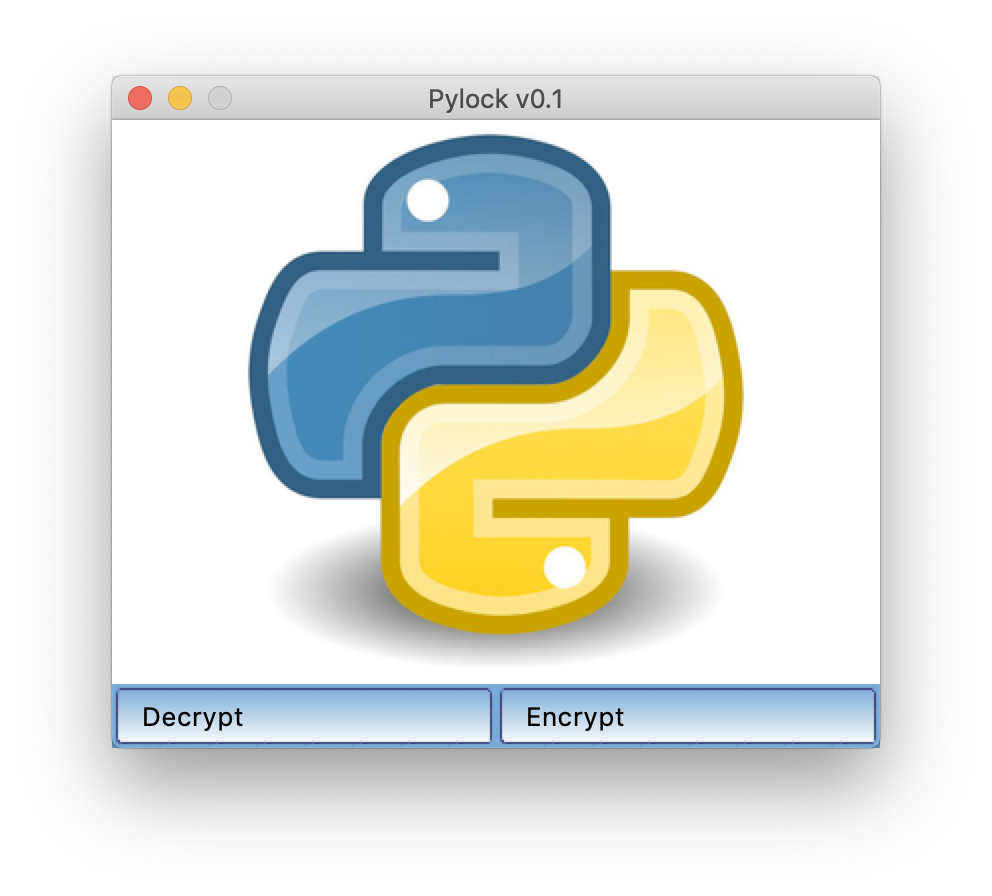

# Pylock
Lock and encrypt files with a given password


Usage:

```Shell
pip3 install -r requirements.txt
python3 pylock.py
```

MacOS:

Mainly developed on and for MacOS. To install, simply move pylock.app to your Applications folder.
